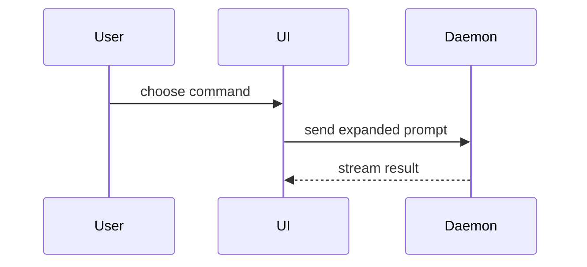

Help the user understand the current topic of conversation visually. Skip the preamble and keep prose brief. Pick the smallest view that makes the key point clear.

Pick the format for where the user is reading. In a terminal, text views (pseudocode, call trees, file trees, diffs) render everywhere and are the default. Mermaid and HTML need a surface that renders them — an artifact, a PR/issue body, or an IDE markdown preview.

- Show logic or an algorithm as pseudocode:

```text
on(save)
  if content is unchanged
    return cached result
  write new content
  return fresh result
```

- Show runtime control flow as a call tree:

```text
submitForm
  createSession
    persistPrompt
    launchAgent
  navigateToSession
```

- Show UI structure as a component tree, including state and module boundaries that matter:

```tsx
<SessionPage> (apps/example/src/routes/session.tsx)
  useSessionEvents()
  <SessionToolbar>
    <RunSkillButton> (packages/ui)
```

- Show file responsibility or a broad refactor as a shallow file tree:

```text
src/
├── commands/       # parses user actions
├── sessions/       # owns session state
└── transport/      # sends API requests
```

- Show component interaction, control flow, or data flow with Mermaid — in an artifact, a PR/issue body, or an IDE preview. A plain terminal does not render it, so there reach for a call tree or a file tree instead:



- Use `diff` when the point is what changes and the surrounding shape already exists. Match the diff shape to the topic.

For a component change:

```diff
 <SessionPage>
   useSessionEvents()
   <SessionToolbar>
+    <RunSkillButton />
   <SessionTimeline>
+    <SkillResultCard />
```

For a file-layout change:

```diff
 src/
 ├── commands/
+│   └── show-me.ts       # expands the slash command
 ├── sessions/
-└── transport.ts
+└── transport/
+    ├── client.ts
+    └── stream.ts
```

For a call-tree or call-stack change:

```diff
 submitForm
   createSession
     persistPrompt
+    expandSkillMention
     launchAgent
-  navigateToSession
+  navigateToSession
+    subscribeToEvents
```

For a state or control-flow change:

```diff
 on(save)
-  write content
+  if content is unchanged
+    return cached result
+  write new content
+  invalidate cache
```

- Show the whole block when most of it is new, when omitted context would hide ownership or order, or when the user needs a copyable target shape:

```ts
function expandSkill(command: string): string {
  const skillName = command.slice(1)
  return `use the ${skillName} skill`
}
```

- For a visual UI, layout, state comparison, or concept too dense for Mermaid, write one focused HTML file — a diagram, an infographic, or a short slide deck, whichever fits the point. Match the product's colors, type, spacing, and components; use real labels and data; support desktop and mobile. Write it to the session scratchpad, then hand it over the way the user can actually open it:

  - publish it with the Artifact tool and give them the link — this also reaches them when they are following the session from another device, or
  - open it locally when a link is overkill:

```
Bash(open path/to/show-me-{description}.html)
```

### guidance

Place each visual next to the short text it supports. Keep only the calls, files, props, states, and boundaries needed to answer the user's current question or the options to resolve the current discussion point.

You may use one of these, you may use several, it is unlikely you will use all of them. Use your judgement and don't overwhelm the user.

## Credits

Vendored from [`humanlayer/skills`](https://github.com/humanlayer/skills/tree/3c2629142c5d437428269b1b722b08c0b87f574d/plugins/show-me/skills/show-me) by @humanlayer — MIT.
Pinned to commit `3c26291`, imported 2026-09-06.
Provenance: adapted — 取り込み後の変更:

- `description` に発火トリガー（英語 + 日本語）を追加
- 「読む場所（ターミナル / アーティファクト）に合わせて形式を選ぶ」方針を冒頭に追加
- Mermaid はターミナルでは描画されない旨を注記
- HTML は scratchpad に書いて Artifact で publish（`open` はローカル確認用のフォールバック）
